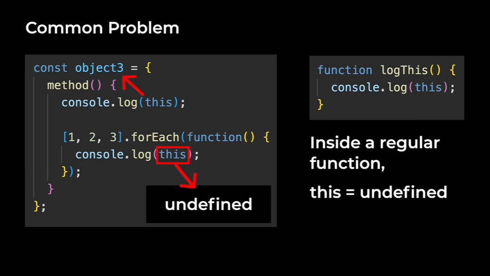
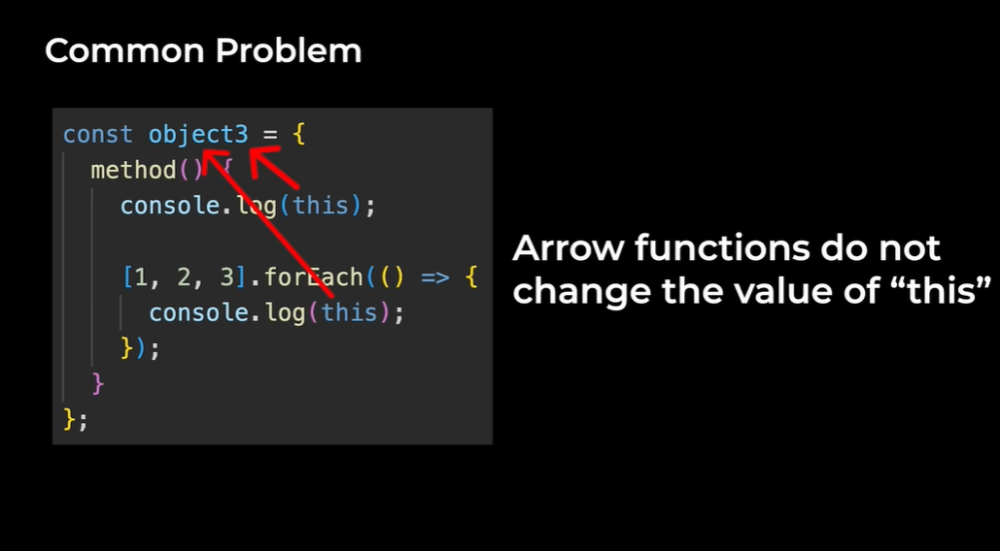

# Object-Oriented Programming

Another style of programming (another way we write our code) — organizing our code into objects.

## Procedural Programming

**Procedure** => a set of step-by-step instructions => a function.

## Object-Oriented Programming (OOP)

**OOP** = organize our code into objects.

```javascript
let variable; // shortcut for
let variable = undefined;
```

**Method** = a function inside an object.

`this` gives us the outer object.

### Why Do We Use OOP?

**Object-Oriented Programming** tries to represent the real world.

```javascript
import '../data/cart-oop.js'; // another way to import
```

Another reason: it's easy to create multiple objects.

## Naming Convention

In OOP, use **PascalCase** for things that generate objects.

**PascalCase** = start every word with a capital.

## Classes

Object-Oriented Programming has a feature called **Class**.

**Class** = object generator.

Each object we generate from a class = an **instance**.

```javascript
console.log(businessCart instanceof Cart); // true/false
```

Classes are a feature that helps us generate these objects.

### Benefits of Classes

Classes have extra features for Object-Oriented Programming.

### Constructor

**Constructor** = lets us run setup code.

More details about the constructor:
1. Has to be named `constructor`
2. Should not return anything

> Basically, a class is a better way to generate objects in object-oriented programming.

## Private Properties and Methods

**Private** = it can only be accessed inside the class.

### Private Fields/Properties

```javascript
class Cart {
    cartItems; // public property
    #localStorageKey; // private property
}
```

### Private Methods

```javascript
class Cart {
    #loadFromStorage() { // private method

    }
}
```

# Inheritance

Lets us reuse code between classes. A **child class** inherits from a **parent class**.

```javascript
super(productDetails); // super() calls the constructor of the parent class
```

## Method Overriding

**Method overriding** => override/replace the parent's method.

## Polymorphism

**Polymorphism** => use a method without knowing the class.

## More Details About Classes

**How to test classes:** testing classes is the same as normal tests.

## Built-in Classes

**Built-in classes** => classes that are provided by the language.

### `new Date()`

Generates an object that represents the current date.

```javascript
const date = new Date();
console.log(date);
console.log(date.toLocaleTimeString());
console.log(date.toLocaleDateString());
```

## More Details About "this"

`this` lets an object access its own properties.

```javascript
console.log(this); // undefined
```

Originally in JavaScript, `this` = `window`. When they released JavaScript modules, inside a module, `this` = `undefined`.

### Using "this" Inside a Function

```javascript
function logThis() {
  console.log(this);
}
logThis(); // undefined
logThis.call('hello'); // hello
```

Not inside of any object, so there's nothing for `this` to point to. `this` = `undefined`.

### Changing "this" Inside a Function

Inside a function, we can change `this` to whatever we want. Functions have a method `.call()`.

```javascript
function logThis(param1, param2) {
    console.log(this);
}
logThis.call('hello', param1, param2);
```

### Arrow Functions and "this"

Arrow functions do **not** change the value of `this`.

```javascript
const object3 = {
  method: () => {
    console.log(this);
  }
};
object3.method(); // undefined
```

Inside an arrow function, `this` is undefined — `this` keeps the value that it had outside the arrow function.

**Why are arrow functions designed this way?**




## Summary of "this"
1. Inside a method, `this` points to the outer object
2. Inside a function, `this` = `undefined` (but we can change it using `.call()`)
3. Arrow functions do not change the value of `this`