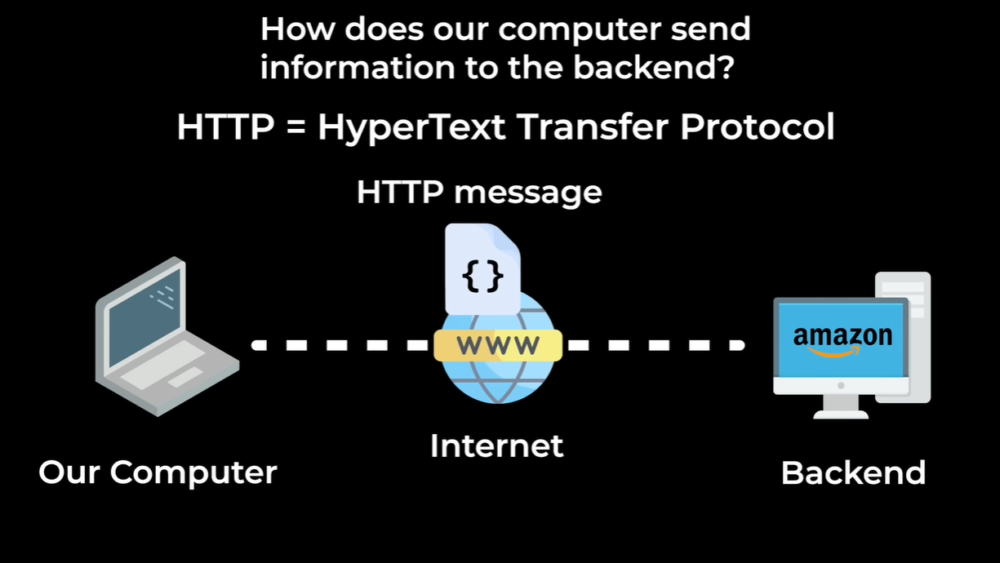
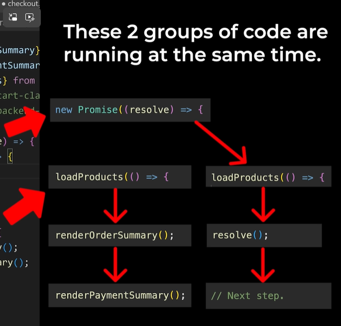

# Intro to Backend, Callbacks, Async Await

## What Is Backend?

**Backend** = another computer that manages the data of a website.

### How Does Our Computer Send Information to the Backend?



We use an **HTTP message**.

**HTTP** = HyperText Transfer Protocol

## XMLHttpRequest

This is a built-in class (provided by JavaScript).

```javascript
new XMLHttpRequest();
```

Creates a new HTTP message to send to the backend. Message = **request**.

```javascript
const xhr = new XMLHttpRequest();
xhr.open(HTTP_Method, Where_to_send_this_HTTP_message);
```

HTTP method like `'GET'`.

### GET

`GET` => get some information from the backend.

**Types of request:** `GET`, `POST`, `PUT`, `DELETE`

## URL

**URL** => Uniform Resource Locator
- Like an address, but for the Internet.
- Helps us locate another computer on the Internet.

```
https://amazon.com
```

`amazon.com` => domain name

```javascript
const xhr = new XMLHttpRequest();
xhr.open('GET', 'https://supersimplebackend.dev');
xhr.send();
```

> browser > inspect > Network tab

**Request-Response Cycle** => 1 request, 1 response

## URL Paths

```
https://supersimplebackend.dev/
https://supersimplebackend.dev/hello
https://supersimplebackend.dev/products/first
```

| URL | Path |
|-----|------|
| `https://supersimplebackend.dev/` | `/` |
| `https://supersimplebackend.dev/hello` | `/hello` |
| `https://supersimplebackend.dev/products/first` | `/products/first` |

A backend only supports a certain set of URL paths.

## Status Code

- Starts with **4** or **5** (400, 404, 500) = failed
  - **4** -> our problem
  - **5** -> backend's problem
- Starts with **2** (200, 201, 204) = succeeded

```
https://supersimplebackend.dev/documentation
```
This is SuperSimpleDev Backend Documentation.

## Backend API

**API** = Application Programming Interface

The backend can respond with different types of data:
1. Text
2. JSON — `JSON.parse()` for converting into a JS Object; this allows us to send JavaScript objects across the Internet, to the backend
3. HTML
4. Image

Using the browser = making a `GET` request.

## Testing With a Backend

```javascript
beforeAll((done) => {
    loadProducts(() => {
        done();
    });
});
```

# Promises and Fetch

## Promises

- A better way to handle asynchronous code
- Similar to Jasmine's `done()` function
- Let us wait for code to finish, before going to the next step

Promise is a class:

```javascript
new Promise((resolve) => {

});
```

`resolve` => it is a function
- Similar to Jasmine's `done()` function
- Lets us control when to go to the next step

The executor function (the function passed into `new Promise()`) runs **immediately** when the promise is created.



> **Note:** JavaScript is still single-threaded — promises don't let JavaScript run multiple things in parallel. What they actually do is let JavaScript **start a slow operation (like a network request) and keep running other code while waiting**, instead of blocking everything until it finishes. When the slow operation completes, the promise's `resolve` function is called and the rest of our code continues.

### Why Do We Use Promises?

Multiple callbacks cause a lot of nesting.

If we have lots of callbacks, our code will become more and more nested (this is sometimes called "callback hell"). Promises solve this problem — they let us flatten our code.

**Use promises instead of callbacks.** Promises keep our code more flat.

### Running Multiple Promises at Once

`Promise.all()`
- Lets us run multiple promises at the same time
- And wait for all of them to finish

## Fetch

`fetch()` = a better way to make HTTP requests.

- `fetch()` uses a promise
- By default, `fetch()` will make a `GET` request
- It's a better way to make requests instead of `XMLHttpRequest()`

```javascript
fetch('https://supersimplebackend.dev/products').then((response) => {
    return response.json();
});
```

`response.json()` is asynchronous — it returns a promise.